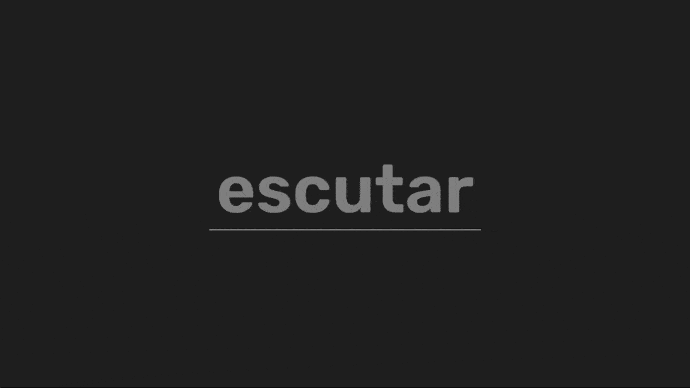

# Typing Game

Projeto construido durante a **Maratona JS 3** do [Emerson Broga](https://github.com/emersonbroga). O objetivo desse projeto é criar um Typing Game utilizando ReactJS. Além disso, foi abordado conceitos como componentização e hooks.

## ⚒ Tecnologias Usadas

- ReactJS

## 🚀 Rodando o projeto

Faça o clone do projeto com o comando `git clone`, use os comandos abaixo: 
`yarn` - Para instalar as dependências necessárias 
`yarn start` - Para inicializar o servidor com a aplicação

---

Feito com 💜 por <a href="https://github.com/weslenmendes">Weslen Mendes</a>

